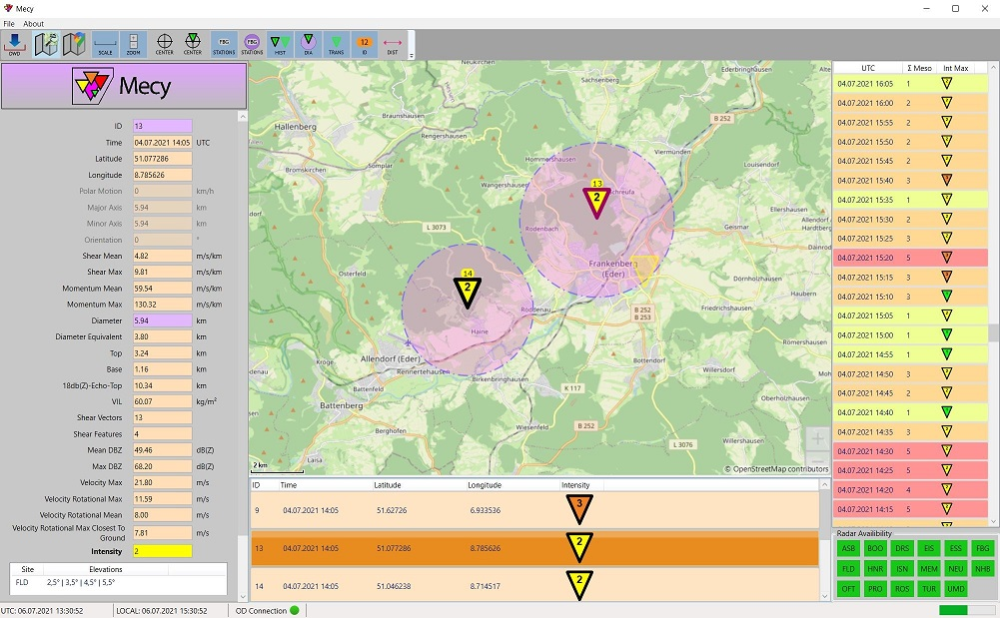

# Mecy - Mesocyclone Visualization

Mecy is a meteorological software for visualizing mesocyclones located in Germany. Datasource is the OpenData server of the german weather authority (DWD).

Mecy shows mesocyclone objects on a map and lets you examine all details.

## Overview
Mecy has a user friendly interface and runs on Windows.

## Functionality
### Open Data Downloader
Mecy automatically downloads the latest mesocyclone data from the OpenData server (DWD).

### Timestamps
All data is stored in timestamps. You can select a timestamp and visualize the corresponding mesocyclones. The timestamps are highlighted with a color that depends on the amount of mesocyclones for a time. Furthermore, the intensity of the mesocyclone with the highest intensity is displayed.

### Mesocyclone List
Mesocyclones are visualized in a list with all important informations.

### Map View
Mecy shows all mesocyclones of a timestamp on a map with the following informations:
- Location
- Intensity (visualized via color and number)
- Diameter

You can center the map to Germany or to the selected mesocyclone.

### Map Style
You can customize the map by enabling and disabling the following features:
- OpenStreetMap style / Google Maps style
- Scalebar
- Zoom buttons
- Radar stations
- Radar station diameters (range)
- Historic mesocyclones (from previous timestamp)

### Map Distance Measuring
Measuring of distances on the map.

### Radar Availability
Radar availability of a selected timestamp is visualized.

### Mesocyclone Details
All parameters of a mesocyclone are listed in the details panel - including a list of the radars that detected the mesocyclone during a radar sweep.

### Time
The status bar shows the UTC and the local time in Germany.

### Connection to the OpenData Server
Shows, if the OpenData server of the DWD is reachable.
